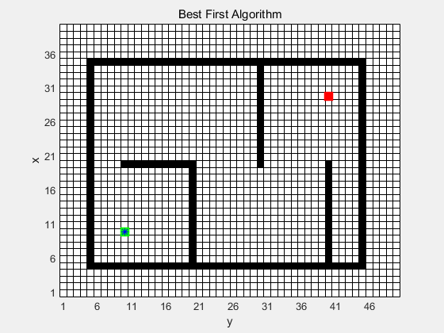
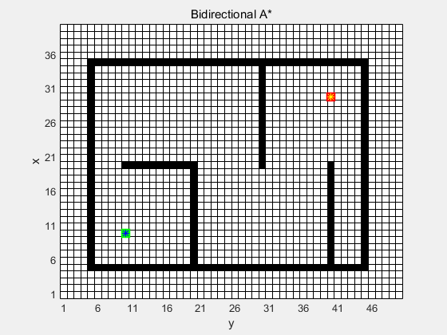

# Planning Algorithms

This repository is to implement various planning algorithms, including Search-based algorithms, Sampling-based algorithms and so on. I learn it much from it and hope it can help you.

Now it's coded in MATLAB, I'll implement them in C++ and ROS in the future.

## Directory Structure

    ├─Sampling_based_Planning
    └─Search_based_Planning
        │  
        ├─BreadFirstSearch, BFS
        ├─DepthFirstSearch, DFS
        ├─DijkstraAlgorithm
        ├─BestFirstAlgorithm
        ├─AStarAlgorithm           
        ├─BidirectionalAStarAlgorithm       

## Some Results
More details can be seen in files.
### C++ with ROS
### A Star Algorithm 

<table>
  <tr>
    <td></a></td>
    <td></a></td>
    </tr>
</table>

### MATLAB
### BFS and DFS

<table>
  <tr>
    <td></a></td>
    <td></a></td>
    </tr>
</table>

<!-- 
 -->

### Dijkstra Algorithm and Best First Algorithm

<table>
  <tr>
    <td></a></td>
    <td></a></td>
    </tr>
</table>

### A Star Algorithm and A Star Variants

<table>
  <tr>
    <td></a></td>
    <td></a></td>
    </tr>
</table>

## References
[[Steven_M._LaValle]_Planning_Algorithms2](https://github.com/YaominJun/path_planning/blob/master/papers/%5BSteven_M._LaValle%5D_Planning_Algorithms2.pdf)

[zhm-real/PathPlanning Python](https://github.com/YaominJun/PathPlanning.git)

