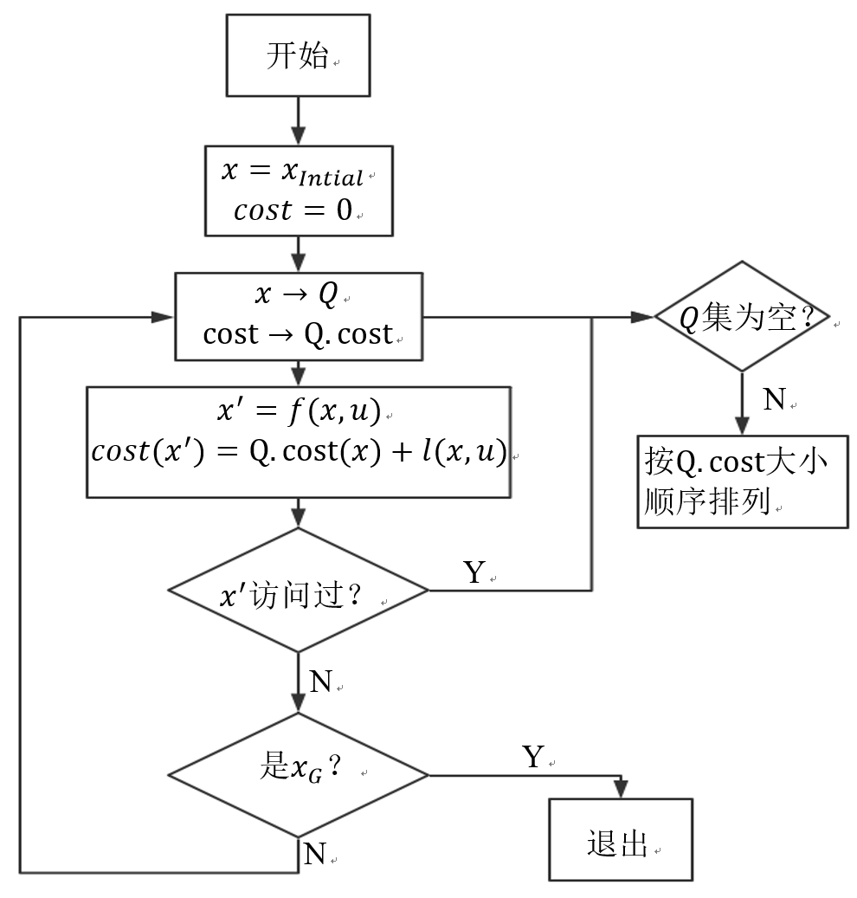
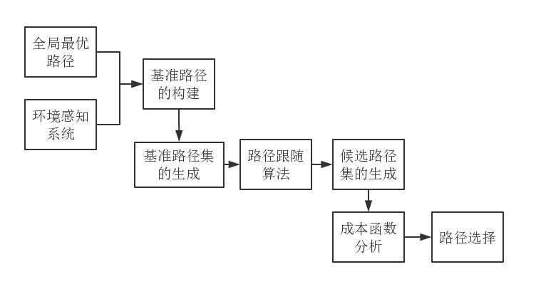
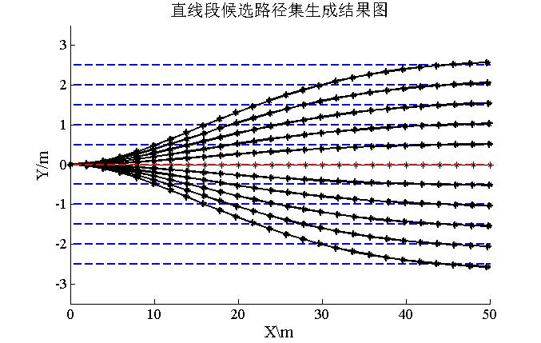
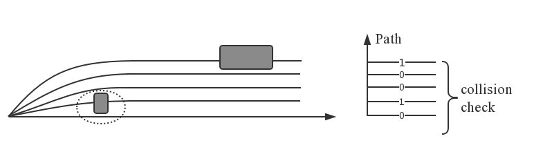
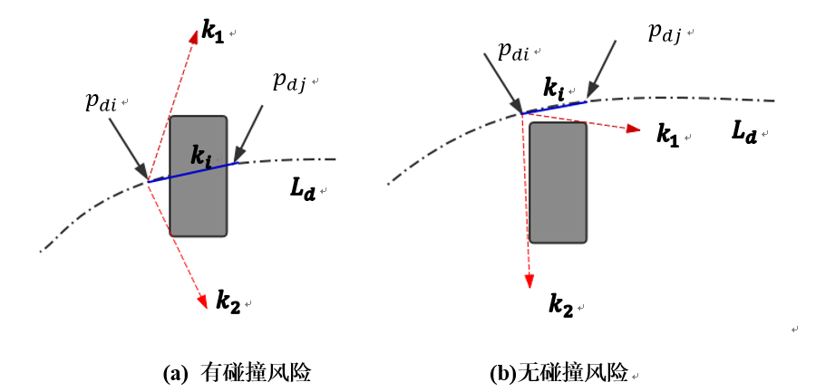
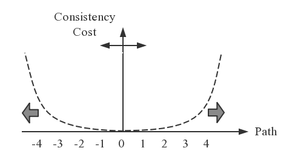

# path_planning

all kinds of path planning algorithms to learn

一步一步慢慢学习

## 1. Dijkstra algorithms

​		经典的Dijkstra算法 ，是一种典型的广度优先搜索算法，可以通过确定了到目的地最短路径之后停止算法运行来找到从单源点到单目的地的最短路径。也可以找到从起点到图中其他各节点的最短路径和长度。
​		Dijkstra算法属于特殊的前向搜索算法，其中一般前向搜索算法的通用思路是：设置状态点$x$的优先级集合$Q$，初始时$Q$集只包含单源点$x_{I}$，并被标记为"已访问"。当$Q$集非空时，通过特定的优先级函数对$Q$集进行排序，再将允许行动的方式$u$作用于当前状态$x$后，由状态转移函数$f\left( x,u \right)$确定新状态点$x^{'}$，由于允许行动的方式可有多种，则生成的为状态点序列。对序列中每个新状态点$x^{'}$，如果是未被访问过的，将该新状态点插入到$Q$集中，并标记为"已访问"，否则重新解算重复的状态点$x^{'}$得到新的排序。期间如果搜索到目标点$x_{G}$，则成功，否则失败。

​		若将应用每一允许行动的方式中行进的路程作为非负代价$l\left( x,u \right)$，则规划的总代价是从单源点$x_{I}$到目标点$x_{G}$的路径上所有非负代价的总和。

​		可见，对优先级集合$Q$进行排序的方式影响了搜索的结果。对于Dijkstra算法而言，设置为已付代价函数$C$，或者称为已经过路径长度函数$C$，对于$Q$集中的各个状态点$x$有其对应的路径长度。图1.1 为Dijkstra算法的程序框图，初始时$C\left( x_{I} \right) = 0$，每次生成新状态点$x^{'}$后，计算$C\left( x^{'} \right) = C\left( x \right) + l\left( x,u \right)$。对于需要重新解算的重复状态点$x^{'}$，比较通过新加入状态点到该点的总路径长度和$Q$集中原有方案下到该点的路径长度值，取较小者插入$Q$集。

图1.1 Dijkstra算法流程图

## 2. Discrete Optimization

​		离散路径规划算法目标是生成一条从车辆起始配置点朝向全局期望路线方向的平滑路径，此算法生成了一系列以基准路径（局部期望路径）作不同横向偏移后的候选路径集。从图2.1可见，该算法主要分解成四个部分：基准路径的构建、基准路径跟随算法的设计、候选路径集的生成和路径选择。

图2.1 离散路径规划算法思路图

#### 候选路径集的生成

​		对基准路径进行一定的横向偏移能得到基准路径集，而根据实际路径场景选择总体横向偏移的范围以及每条候选路径之间的间隔距离是影响离散路径规划算法实时性和安全性的重要因素。

​		通过设计合理的路径跟随算法，车辆能平滑过渡到各基准路径上，从而生成候选路径集。结果如图2.2所示，图中红色虚线表示初始基准路径，与其平行的蓝色虚线为进行横向偏移后的基准路径集，带星点的黑色线条均从车辆位置引出，跟随到每条基准路径上，为生成的候选路径集。

由点$P_{\text{Bi}}$到点$P_{\text{di}}$，横向偏移过程中保持切线倾角$\theta$不变，则有：
$$
x_{\text{di}} = x_{\text{Bi}} - dsin\theta \\
$$

$$
y_{\text{di}} = y_{\text{Bi}} + dcos\theta \\
$$

图2.2 候选路径集生成结果

#### 成本函数分析

​		为了进行路径选择，将带有权重因子的各成本进行线性组合，对组合后构成的成本函数进行分析，选择成本最小的路径作为局部路径规划的结果。

​		保证车辆无碰撞地通过每一段道路区域，这称为安全性成本$C_{S}$。同时，初始基准路径为无临时障碍物出现时的最佳路径，为了防止过于强调安全性成本而绕远路、降低工作效率等不良现象的发生，引入一致性成本$C_{C}$，即相对于初始基准路径的一致性差异。
$$
J_{d} = w_{S}C_{Sd} + w_{L}C_{Cd}
$$
​		**安全性成本**是指每条候选路径行驶的碰撞风险。其求解步骤为：

（1）碰撞风险分析。将被检测到有障碍物的路径记为有风险，用"1"表示，没有障碍物的路径记为无风险，用"0"表示。如图2.3(a)所示，其中灰色方框表示障碍物，黑色实线为部分候选路径集。图2.3(b)为碰撞风险分析结果。

(a)候选路径集示意 (b)碰撞风险分析结果

图2.3 碰撞风险分析示意图

​		候选路径集的碰撞风险是根据路径上两点连线斜率大小来判定的。将图2.4的虚线框放大，如图2.5所示，图中点划线代表沿基准路径横向偏移距离$d$后的候选路径$L_{d}$，$L_{d}$由一系列点$p_\text{di}(x_\text{di},y_\text{di})$   组成，设候选路径$L_d$上不在障碍物$x$方向坐标范围内且距离障碍物左、右端最近的点分别为$p_\text{di}$、$p_\text{dj}$。以点$p_\text{di}$为原点，连接障碍物四顶点，作直线包络障碍物，如图中红色虚线所示，包络直线的最大、最小斜率分别为$k_1$、$k_2$。连接点$p_\text{di}$和点$p_\text{di}$，如图中蓝色实线所示，其斜率为$k_i$。则候选路径$L_d$的碰撞风险分析结果可用下式表示：

​    

图2.4 碰撞风险示意图

（2）安全性成本量化。一方面，无人车行驶时距离障碍物横向距离过近时，由于定位误差、道路条件、控制精度、车体尺寸等因素的存在，会使得行驶过程中产生安全隐患，也不利于提高车速。另一方面，由于计算资源或硬件设备条件的限制，感知系统反馈信息会有时间延迟，同时，车辆制动、减速等也具有一定的反应时间，故存在车辆纵向方向上的最小安全距离限制。

​		综合来看，利用第一步碰撞风险分析后得到的碰撞信息矩阵，将车辆与障碍物之间的距离作为安全性成本计算基础，其中距离又包括横向距离和纵向距离。

​		**一致性成本**

​		评估每条路径的一致性成本以保证选择出的路径与初始基准路径不会相差太大。与横向距离安全性成本类似，一致性成本可以用路径$L_{d}$和初始基准路径$L_{B}$之间的横向偏差距离来计算得出。

​		与横向距离安全性成本不同的是，如图2.5所示，我们认为初始基准路径$L_{B}$附近一定范围内的路径$L_{d}$的一致性成本均较低，而当超过某一范围时，成本才急剧增加。图中路径0代表初始基准路径，虚线表示计算一致性成本的函数。这样能更好地优先选择靠近路径$L_{B}$一定区域内的路径，而不是用如图2.5所示的线性递减函数来使得路径选择时仅仅执着于初始基准路径，而忽略了其附近路径的同等可行性。

图2.5 一致性成本示意图

#### 路径选择

​		对候选路径集中的每条路径进行成本函数分析，选择最小成本函数的路径作为局部路径规划结果。成本函数的设计考虑了安全性、一致性两个方面。最终选择出的路径，能够实现安全避障和跟随基准路径两个目标。

***

## 一步一步继续加油！

