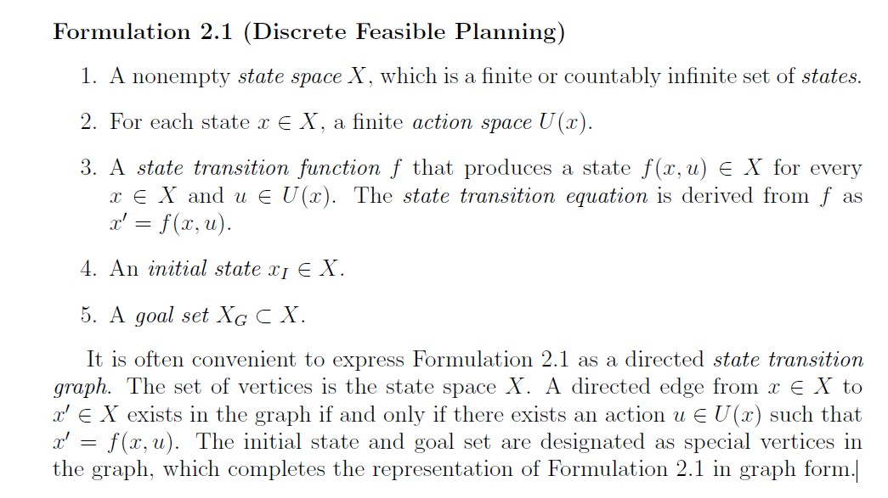
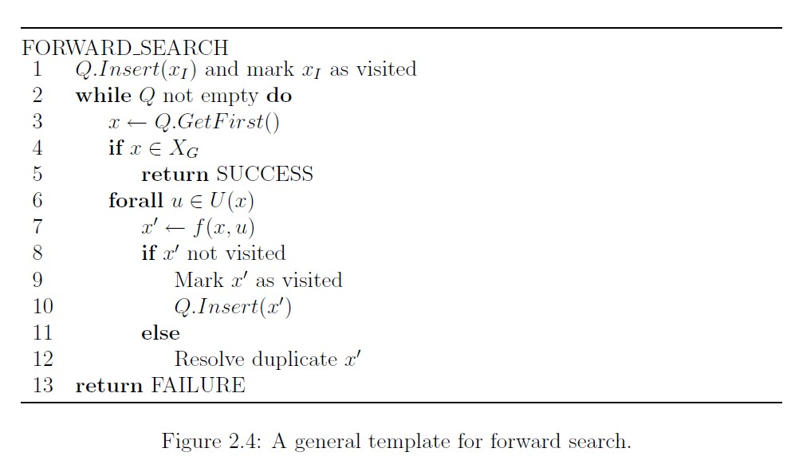

# search based planning method
* the discrete planning/离散规划概述

离散可行规划The discrete feasible planning 使用状态空间(state-space)模型进行定义。主要含义是，地图中的每个不同情况/situation被称作一个状态state，用x表示，所以可能的状态集合为状态空间state space，用X表示。对于离散规划而言，要保证是该集合是可数的、有限的。 
状态state的定义很关键。不要将无用信息加入到其中而增加复杂度。 
动作action，用u表示，指的是能够从当前状态x到新状态x'的行为。而这个行为用状态转移函数 f 进行定义。也可以定义为有向图的形式。 
`x' = f(x,u)`  
状态空间是X，动作空间是U(x)。 
初始状态X_I，目标状态X_G。 
离散规划的统一表述形式： 

* 通用的前向搜索算法框架： 

其中，Q是指优先级队列(搜索算法中的唯一显著区别就是对Q进行排序的特定函数)，xI是起点，XG是终点集合。 
这只是总的框架，有很多小细节，比如1. 如何判断x ∈XG; 2. 如何输出plan结果，即动作action序列; 3. 如何判断x'已经访问过visited (比如邻接矩阵，邻接表等); 4.如何定义排序方式等。 

* 典型的forward search methods前向搜索算法： 

1. Breadth first广度优先搜索【不包含路径权重】
2. Depth first深度优先搜索【不包含路径权重】
3. Dijkstra’s algorithm【包含路径权重】
4. A-star【包含路径权重】
5. Best first【包含路径权重】
6. 

* 通用的后向搜索算法框架： 

其中，Q是指优先级队列(搜索算法中的唯一显著区别就是对Q进行排序的特定函数)，xI是起点，XG是终点集合。 
注意，动作序列为u^-1，说明需要不是当前点能到那些邻接点，而是哪些邻接点能够到达当前点。对应的状态转移方程f^-1，即向后搜索。

<!-- * 典型的backward search  methods后向搜索算法:  -->

* 通用的双向搜索算法框架： 

其中，QI是指从起点出发的优先级队列(搜索算法中的唯一显著区别就是对Q进行排序的特定函数)，QG是指从终点出发的优先级队列，xI是起点，XG是终点集合。 

<!-- * 典型的bidirectional search  methods双向搜索算法:  -->

## breadth first
可以用于求(每条路径权重为1的)最短路径。
* matlab程序实现: 
  
  **BreadFirstSearch**文件夹里 
* matlab实现结果： 
  

* 思路逻辑

类似于树中的层序遍历的扩展：所以一定是随着边edge的长度增加而逐渐一层一层地访问下去。 
步骤： 
①将起点/根节点压入队列中，然后弹出，并将该弹出节点的邻接点压入到队列中； 
②重复弹出节点并将弹出节点的尚未访问过的邻接点压入到队列中； 
③直至队列为空，所有点都已经遍历完成(针对遍历)；对于找终点而言，就是到达终点结束。 

* 数据结构思路： 
**先进先出(FIFO, First-In First-Out)** -> 优先级队列

## depth first
不可以用于求(每条路径权重为1的)最短路径，而只是用于搜索。
* matlab程序实现: 
  
  **DepthFirstSearch**文件夹里 
* matlab实现结果： 
 

* 思路逻辑

类似于树中的先序遍历的扩展：所以一定是某一边的访问完了，再到另一边。 
这个与A* 还不一样，因为A*有启发值，但是这个没有，就是随机地往某个方向走，走不通了再返回。 
步骤： 
①当前节点遍历，从邻接点中随机选择一个尚未遍历的顶点vertex继续遍历； 
②如果当前节点的所有顶点都遍历过，就原路返回；【程序里用堆栈来实现】 
③循环①②； 
④直到回到起点(针对遍历)；对于找终点而言，就是到达终点结束。 
深度优先搜索（Depth-First-Search），简称 DFS，最直观的例子就是走迷宫。 
假设你站在迷宫的某个分岔路口，你想找到出口。你随意选择一个岔路口来走，走着走着发现走不通的时候就原路返回到上一个分岔路口，再选择另一条路继续走，直到找到出口，这种走法就是深度优先搜索的策略。 

* 数据结构思路： 
**后进先出(LIFO, Last-In, First-Out)** -> 堆栈

## Dijkstra’s algorithm
可以用于求(带权重的)最短路径。 
与BFS和DFS不同的是，需要进行代价更新。见“通用的前向搜索算法框架”中的第12行。

* matlab程序实现: 
  
  **DijkstraAlgorithm**文件夹里 

* matlab实现结果： 
 

* 思路逻辑

步骤： 
①初始化代价dist矩阵为inf，正无穷∞；将代价为0的起点放入优先级队列。 
②如果优先级队列为空，则退出，说明搜索失败；否则，从优先级队列中选择一个最小代价的顶点vertex作为当前节点； 
③遍历当前节点的周围搜索邻接点，如果该邻接点G代价小于原本的G代价，并且没有从队列中取出过，就**更新代价dist矩阵**，并放入优先级队列；否则**更新优先级队列中的该已有的邻接点代价**【程序里用最小堆（优先级队列）来实现】 
④循环②③； 
⑤直到到达终点。 
注意：这里的dist就不能初始化为-1了，因为需要满足不等式 dist[W] + E<V,W> < dist[W] ，所以这里dist[i]应该初始化为正无穷∞；同时起点的邻接点的dist初始化为对应的权重值。 

* 数据结构思路： 
**优先级队列**

# A star
可以用于求(带权重的)最短路径。 
与Dijkstra’s algorithm不同的是，代价多了启发项。

* matlab程序实现: 
  
  **AStarAlgorithm**文件夹里 

* matlab实现结果： 

* 思路逻辑

与Dijkstra’s algorithm几乎一模一样，只是代价值计算的时候多了启发项(到目标点的距离)： 
可以看到程序中的对比： 
1. Dijkstra’s algorithm

        V.Q = g_cost;

2. A star

        V.Q = g_cost+h_cost;

* 数据结构思路： 
**优先级队列**

## Best first
不能保证一定可以找到(带权重的)最短路径。 
与A star不同的是，代价只考虑启发项。

* matlab程序实现: 
  
  **BestFirstAlgorithm**文件夹里 

* matlab实现结果： 

* 思路逻辑

与Dijkstra’s algorithm几乎一模一样，只是代价值计算的时候只考虑启发项(到目标点的距离)： 
可以看到程序中的对比： 
1. Dijkstra’s algorithm

        V.Q = g_cost;

2. A star

        V.Q = g_cost+h_cost;

3. Best first

        V.Q = h_cost;

* 数据结构思路： 
**优先级队列**

## Bidirectional A Star Algorithm
从此开始有许多A*算法的变种，可以查看：
[Amit’s A* Pages](https://theory.stanford.edu/~amitp/GameProgramming/index.html)

* matlab程序实现: 
  
  **BidirectionalAStarAlgorithm**文件夹里 

* matlab实现结果： 

* 思路逻辑
双向A*，在原本的forward A*基础上考虑了同时从起点和终点出发，直到两者相遇。

* 数据结构思路： 
**优先级队列**

## Anytime Repairing A*

