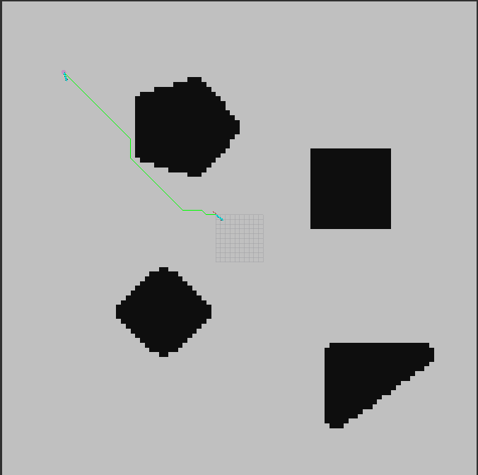
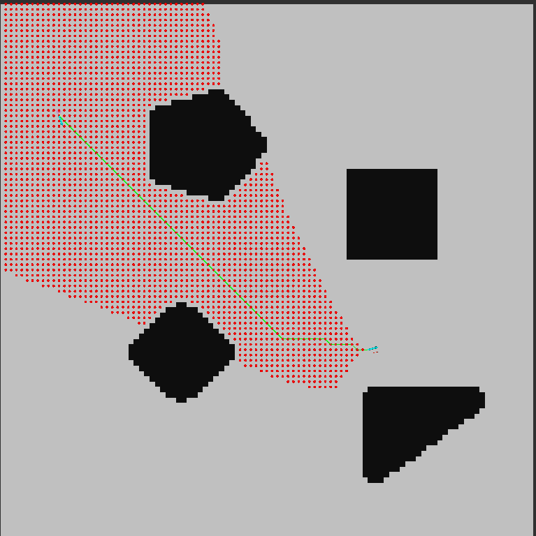
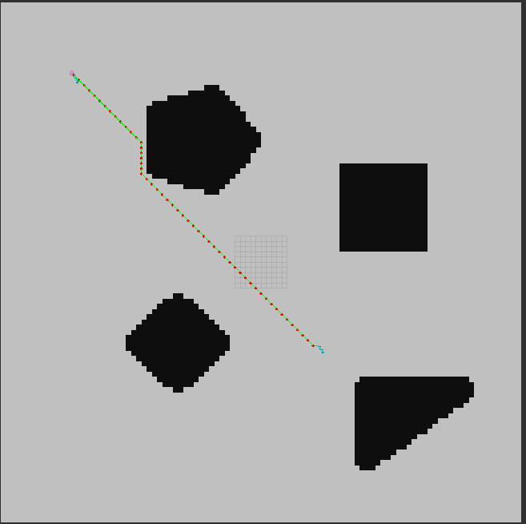

# searched based path planning algorithm

## Result
### A Star 
最终路径（绿色路径）： 

<table>
  <tr>
    <td></a></td>
    </tr>
</table>

显示过程中的closed_set集合（红色点）： 

<table>
  <tr>
    <td></a></td>
    </tr>
</table>

### Dijkstra
显示过程中的closed_set集合（红色点）： 

<table>
  <tr>
    <td></a></td>
    </tr>
</table>

### best first search
显示过程中的closed_set集合（红色点）： 

<table>
  <tr>
    <td></a></td>
    </tr>
</table>

## Usage

    catkin build
    source devel/setup.bash

then start the launch file:

    roslaunch a_star demo_a_star.launch
or,

    roslaunch a_star demo_dijkstra.launch
or,

    roslaunch a_star demo_best_first_search.launch

在rviz中选择起点`2D Pose Estimate`和终点`2D Nav Goal`： 

<table>
  <tr>
    <td></a></td>
    </tr>
</table>

可以在`config/params.yaml`设置`show_closed_set: true`来控制是否显示closed_set_的集合。

## Dependences
    Linux
    ROS

## Design
(1) 整体框架

完整的规划都需要： 
输入：
- 地图
- 起点
- 终点

输出：
- 最终路径

(2) 关键步骤

1. 地图处理

本次采取的是第二种模式

两种模式： 
- 用 ros自带的 map_server包，然后0-1 邻接矩阵表示障碍物和自由区域。直接在程序里写地图。

对于简单的框架还是可以用 0-1 邻接矩阵表示。

http://wiki.ros.org/map_server

launch里： 

    <node name="map_server" pkg="map_server" type="map_server" args="$(find hybrid_astar)/maps/map.yaml" />

package.xml里：

    <run_depend>map_server</run_depend>

- 用grid_map

对于后续复杂的，可以用gridmap来实现，从而直接通过设定的图像。 
https://github.com/ANYbotics/grid_map

在函数`isCollision`中： 

    bool AStar::isCollision(const Eigen::Vector2d& pos) const {
    // grid_map::Position is the another name of Eigen::Vector2d
    // check if it's collision
    // 0 - 255, 0 is black, 255 is white
    if (map_.isInside(pos)) {
        return map_.atPosition("obstacle", pos, grid_map::InterpolationMethods::INTER_LINEAR) < FLAGS_collision_epsilon;
    } else {
      return true;
    }
}

1. 思路

规划器类： 
①构造函数：订阅话题：地图map (nav_msgs/OccupancyGrid) 、起点/initialpose、终点/move_base_simple/goal

②处理地图：

    nav_msgs::OccupancyGrid::Ptr grid;

③碰撞检测.cpp： 
二维下直接根据地图的是否为障碍物即可。

    if (t == 99) {
      return !grid->data[node->getIdx()];
    }

④A star框架： 
优先级队列 

<table>
  <tr>
    <td></a></td>
    </tr>
</table>

其中，Q是指优先级队列(搜索算法中的唯一显著区别就是对Q进行排序的特定函数)，xI是起点，XG是终点集合。 
这只是总的框架，有很多小细节，比如
1. 1.  如何判断x ∈XG; 

            isEqual(current_node, &end_state_)

2. 2. 如何输出plan结果，即动作action序列; 

            extractPath(current_node, final_path);

3. 3. 如何判断x'已经访问过visited (比如邻接矩阵，邻接表等); 

            if (checkExistenceInClosedSet(*child)) {
                continue;
            }

4. 4. 如何定义排序方式等。 
            
            struct PointCmp
            {
                bool operator()(const APoint* apoint_a, const APoint* apoint_b) const {
                    return apoint_a->f() > apoint_b->f();
                }
            };

            std::priority_queue<APoint*, std::vector<APoint*>, PointCmp> open_set_pq;

* 典型的forward search methods前向搜索算法： 
1. Breadth first广度优先搜索【不包含路径权重】
2. Depth first深度优先搜索【不包含路径权重】
3. Dijkstra’s algorithm【包含路径权重】
4. A-star【包含路径权重】
5. Best first【包含路径权重】
6. 
由于框架类似，因此，Dijkstra和best first search算法直接继承于A Star算法，只是修改相应的`getG`和`getH`函数，因为三者的区别只是考虑的代价值不同：
1. Dijkstra’s algorithm

        V.Q = g_cost;

2. A star

        V.Q = g_cost+h_cost;

3. Best first

        V.Q = h_cost;
更多详细内容可以参考关于搜索算法的总的README文件。

## More Knowledge
1. unordered_set

用途：方便地判断某个节点是否已经存在于close_point中了。 
使用：重写 == 号；另写哈希函数类。 
https://blog.csdn.net/aggie4628/article/details/104147211

    std::unordered_set<APoint, APointHash> open_set_;
    std::unordered_set<APoint, APointHash> closed_set_;

    // Point for A* search.
    struct APoint {
        double x{};
        double y{};
        double g{};
        double h{};
        inline double f() const {
            return g + h;
        }
        APoint *parent{nullptr};
        APoint(double x, double y, double g, double h, APoint* parent)
            : x(x), y(y), g(g), h(h), parent(parent) {}
        APoint() = default;
        APoint(const APoint& apoint) {
            x = apoint.x;
            y = apoint.y;
            g = apoint.g;
            h = apoint.h;
            parent = apoint.parent;
        }
        bool operator<(const APoint& apoint) const {
            return f() > apoint.f();
        }
        bool operator==(const APoint& apoint) const {
            return (x == apoint.x) && (y == apoint.y);
        }

        // // Layer denotes the index of the longitudinal layer that the point lies on.
        // bool is_in_open_set{false};
    };

    struct APointHash
    {
        size_t operator()(const APoint& apoint)const {
            //重载hash
            return std::hash<double>()(apoint.x) ^ std::hash<double>()(apoint.y);
        }
    };

注意：在这里unordered_set需要包含的是APoint类，而不是APoint指针。因为，在检测某个APoint是否存在于closed_set_中时，考虑的是APoint这个元素是否在里面，而不是该元素的指针。同时，这类判断是否在unordered_set中是根据重载的`operator==`而确定的，因此，可以很方便地设置相等的条件。如这里只要是两个APoint的横纵坐标相等，就认为是相同的元素，所以在A星不停搜索过程中，有重复的元素出现，即使g、h等不同，只要横纵坐标相同，就认为相同，就认为出现在closed_set_中。 
因此，注意两点：（1）unordered_set包含的是APoint类；（2）APoint类的重载==号的设置。

2. unordered_map

本来有unordered_map来记录parent和g_score的，类似于zhm-real里的一样，但是这里可以很方便地设定APoint类，用该类去寻找parent和记录g、h代价即可。

3. priority_queue

用途：优先级队列方便快速获取开集中当前最小的代价节点。 
使用：重写<号：< < 大顶堆、< > 小顶堆； 
注意写拷贝构造函数时需要将所有内容填充过去，否则在用vector构造priority_queue的时候会丢失数据。 

    std::priority_queue<APoint*, std::vector<APoint*>, PointCmp> open_set_pq;

    struct PointCmp
    {
        bool operator()(const APoint* apoint_a, const APoint* apoint_b) const {
            return apoint_a->f() > apoint_b->f();
        }
    };

注意：在这里priority_queue需要包含的是APoint指针，而不是APoint类。这是因为每次在`current_node = open_set_pq.top();`的时候，如果保存的是APoint类，那么在`child->parent = current_node;`的时候，parent的指向永远指向于同一个current_node地址，而不会随着top()出来的值的变化而变化。而设置为存储APoint指针时，可以直接`child->parent = current_node;`来保证指向的是不同的地址，同时，也要注意获取邻接点时是放在`std::vector<APoint*> sampled_points_;`里，而不是存储的APoint类后，取出然后找它的地址，这样的地址也全都是vector数组的地址，而不是新的new出来的地址。 
因此，注意三点：（1）priority_queue需要包含的是APoint指针；（2）`std::vector<APoint*> sampled_points_;`包含的是APoint指针；（3）`updateNeighbor`时需要新建APoint：`APoint* nextnode = new APoint();`。

同时，还需要注意：对不确定的数据结构操作方法或算法等，可以先用简单的案例测试，测试过程中了解情况了后，再对复杂的算法进行处理。

4.有关继承的内容 
因为这里的Dijkstra算法、A Star算法、best first search算法的结构类似，只是代价值不同，因此在写了A Star算法之后，Dijkstra算法和best first search算法可以直接继承于A Star算法，然后在此基础上进行简单的修改即可。 
注意的细节： 
（1）即使派生类public继承于基类，也不能访问基类的private成员，因此需要将基类的并且之后还用于派生类的成员变量或成员函数设置为protected。 

（2）要让派生类能修改基类的函数，需要将其设置为虚函数，在基类的该成员函数前加入virtual关键字；并且在派生类的该重写的函数后面添加override，以在编译时方便及时地判断派生类是否真的重写了该函数。 
如果在基类的该函数前没有添加virtual，但是在派生类的该函数后添加了override，会提示错误： 

    XXX marked override, but does not override。
因此能及时检查出错误。 

（3）一般都要设置虚析构函数，否则派生类不会被析构。 

其他注意事项： 
平常在复制.hpp或.h文件时，不能只是修改文件里的内容，对应的宏定义 #ifndef XXX_HPP_系列也需要进行更改，否则只会编译复制后的文件，而复制前的文件不会编译了，因为被前者的宏定义覆盖了。 
